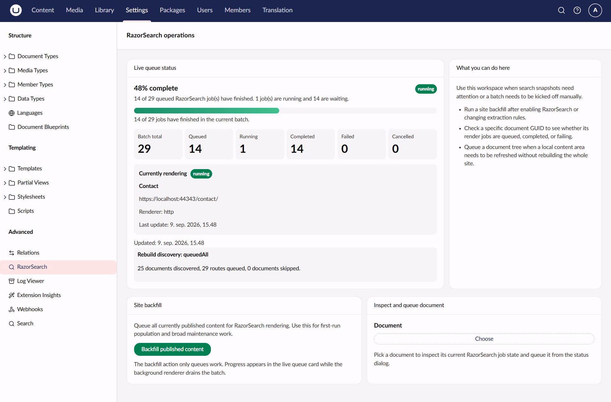
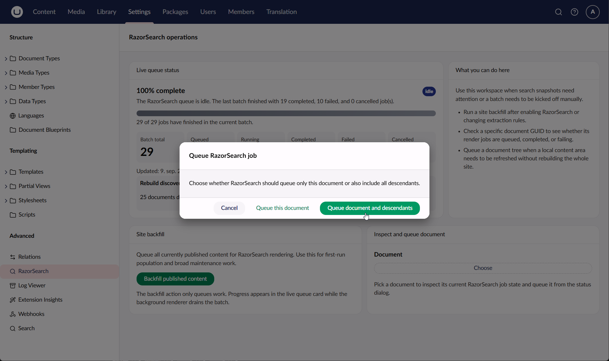
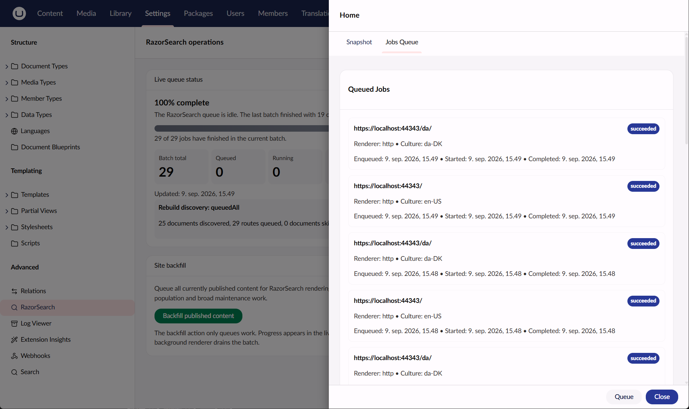
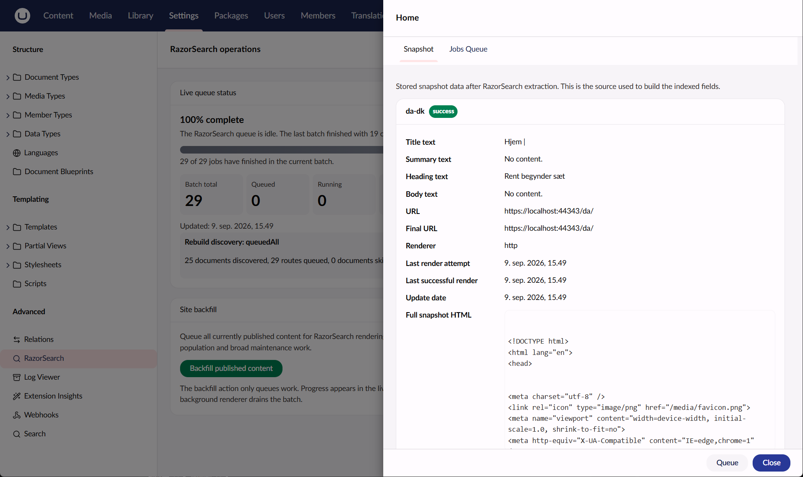
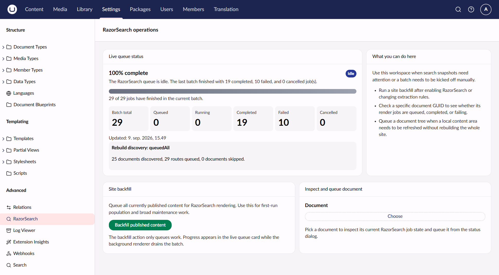
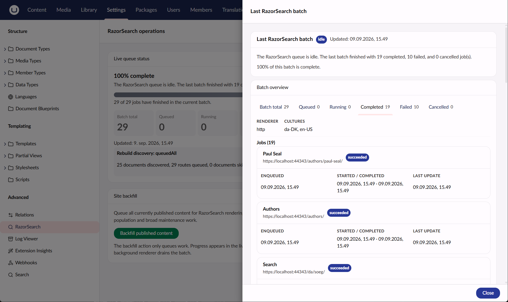

# Indexing and operation

Rendering produces persisted snapshots. Umbraco Search reads those snapshots into a separate RazorSearch index. Rebuilding a Search index does not rerender HTML.

## Snapshot lifecycle

There is one current snapshot per document key and normalized culture. Route and renderer are metadata. A successful render replaces the earlier snapshot. Title, summary, headings, body, combined text, HTML and public URL are stored alongside attempt status.

Publishing queues eligible documents and cultures. Saving a draft does not remove published text. Unpublishing, deletion, recycle-bin moves and exclusions remove affected snapshots. Moves and URL changes refresh affected routes, including descendants. A superseded render cannot restore invalidated content.

Transient rendering errors preserve the last usable snapshot and record the failed attempt separately. Retries are bounded. New publications during rendering leave work queued for the latest generation.

Snapshot writes and deletes request a distributed Search refresh. Search indexes title as `TextsR1`, headings as `TextsR2`, and body as `Texts`, using the package's fixed aliases. Summary text is used for result display rather than full-text matching.

The public field aliases are:

- `RazorSearch_Title`
- `RazorSearch_Heading`
- `RazorSearch_Content`
- `RazorSearch_Summary`

`RazorSearch_Summary` is stored for result display. It is not a full-text match field.

A completed render job means the snapshot was stored and an index refresh was requested. Examine exposes index changes through its near-real-time searcher refresh; distributed cache delivery can add another delay on frontend nodes. Results may therefore become visible after the render queue is already idle. Acceptance checks should wait for the expected query or actual index contents on each node, with a bounded timeout, rather than treating queue completion as index readiness.

## Rebuilds

Administrators can start a global rebuild from the RazorSearch dashboard. Editors can rebuild documents they can publish within their content start nodes. Subtree rebuilds also enforce descendant permissions. Raw HTML and global queue details require administrator access. These restrictions apply to direct API calls as well as the UI.



The dashboard shows live progress while a backfill is running, including queued, running and completed jobs. The backfill action only queues work; rendering continues in the background.

A rebuild runs as a background operation. Content is traversed in batches, without an implicit 250- or 5,000-document cutoff. The API returns HTTP 202 after accepting work.



Documents can be queued individually or together with their descendants. The last batch view also exposes the renderer, cultures and individual job outcomes:



The backoffice displays **expected index content**, derived from snapshots. It does not read or compare the provider's current fields. Use provider tools when diagnosing an actual index discrepancy.



The snapshot view is useful for inspecting the extracted title, headings, body, URL and stored HTML before investigating provider-specific index contents.

Failed jobs are shown in the same views. A failed render does not by itself mean that the previous usable snapshot was removed; see [Troubleshooting](../troubleshooting/README.md) for recovery guidance.



The batch details view can be used to identify whether failures are isolated to particular URLs, cultures or render attempts:



## Management API

The management endpoints require an authenticated backoffice user and are available on the single server or dedicated backoffice server. Queue and rebuild requests return `202 Accepted` and continue in the background.

Queue one document:

```http
POST /umbraco/management/api/v1/razor-search/document/{id}/queue
POST /umbraco/management/api/v1/razor-search/document/{id}/rebuild
```

The two document routes are aliases. Use this body to include descendants:

```json
{
  "includeDescendants": true
}
```

Queue all published content. This endpoint requires an administrator:

```http
POST /umbraco/management/api/v1/razor-search/published/rebuild
```

Inspect a document's snapshots and render jobs:

```http
GET /umbraco/management/api/v1/razor-search/document/{id}/status
```

Administrators can inspect queue state with:

```http
GET /umbraco/management/api/v1/razor-search/queue/status
GET /umbraco/management/api/v1/razor-search/queue/batch
GET /umbraco/management/api/v1/razor-search/queue/stream
```

Document queueing requires publish access to the document. Subtree queueing also requires access to its descendants. Non-administrators do not receive raw snapshot HTML in management responses.

## Manual maintenance

Rebuild affected documents after changing templates, shared content used by templates, extraction rules or exclusion settings. Add this step to deployments that change rendered search content. Dependencies between templates and documents are not tracked automatically.

The queue, operations and job history live in memory. Restarting loses unfinished work. Persisted snapshots and attempt information remain. Run another manual rebuild when a restart interrupted publishing or rebuilding. Completed job history has bounded retention.

## Load balancing

The supported beta topology is one dedicated backoffice server and multiple frontend servers. They share SQL Server and snapshot data but have separate local Examine index directories. SQLite is for single-instance use and is not release-verified in this beta; see the [known limitations](../release-notes.md).

The backoffice owns render jobs and management operations. Frontends read snapshots and receive index refreshes through Umbraco Search's distributed cache mechanism. RazorSearch leaves `sameOriginOnly` at its default false for this local-index topology. Multiple active backoffice servers are outside the beta scope.

Configure an internal render destination on the dedicated backoffice, for example:

```json
{
  "Umbraco": {
    "Community": {
      "RazorSearch": {
        "HttpRenderer": {
          "RenderBaseAddress": "http://127.0.0.1:8080"
        }
      }
    }
  }
}
```

Supply `Umbraco__Community__RazorSearch__RenderRequestToken` through deployment secrets. The renderer connects to the internal origin but retains the public Host and path; token-authenticated middleware restores the public scheme. Configure the internal listener to accept those public hosts. Bypass CDN and frontend caches so rendering sees fresh published content. Do not expose the token in source control or public browser requests.

Deploy matching versions/configuration on all nodes. Start the backoffice first and complete database migrations before frontend traffic. A new frontend must build its local Search index from shared snapshots. Verify publication, URL changes and unpublication reach each frontend before enabling traffic.
