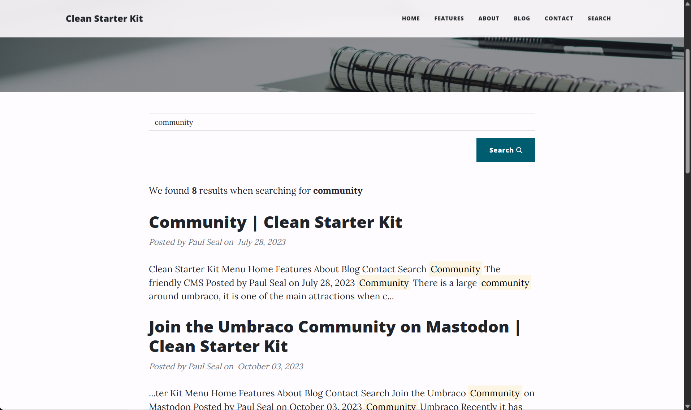

# Usage

Inject `IRazorSearchService` and call `SearchAsync` with a `Umbraco.Community.RazorSearch.Models.RazorSearch` request.

## Complete search template

Create an Umbraco document type with a template containing the following Razor. The document type can be invariant or vary by culture. Publish the search page and some other pages, then rebuild snapshots.

```cshtml
@inherits Umbraco.Cms.Web.Common.Views.UmbracoViewPage
@using Umbraco.Community.RazorSearch
@using Umbraco.Community.RazorSearch.Models
@using Umbraco.Extensions
@inject IRazorSearchService SearchService
@{
    Layout = null;
    string query = Context.Request.Query["q"].ToString();
    int.TryParse(Context.Request.Query["page"].ToString(), out int page);
    page = Math.Max(1, page);
    IRazorSearchResult? results = null;
    if (!string.IsNullOrWhiteSpace(query))
    {
        var request = new RazorSearch(query)
            .UnderRoot(Model.Root().Key)
            .Page(page, 10);
        string? culture = Model.GetCultureFromDomains();
        if (!string.IsNullOrWhiteSpace(culture))
        {
            request.InCulture(culture);
        }
        results = await SearchService.SearchAsync(request, Context.RequestAborted);
    }
}
<!DOCTYPE html>
<html>
<head><title>Search</title></head>
<body>
<main>
    <form method="get">
        <label for="q">Search</label>
        <input id="q" name="q" value="@query" />
        <button type="submit">Search</button>
    </form>
    @if (results is not null)
    {
        <p>@results.Total results</p>
        <ul>
        @foreach (var item in results.Items)
        {
            <li>
                <a href="@item.Url">@item.Title</a>
                <div>@Html.Raw(item.SummaryHtml)</div>
            </li>
        }
        </ul>
        @if ((long)page * 10 < results.Total)
        {
            <a href="?q=@Uri.EscapeDataString(query)&amp;page=@(page + 1)">Next page</a>
        }
    }
</main>
</body>
</html>
```

Razor views support `await`. Do not override `RenderController.Index()` with `Task<IActionResult>`; its override returns `IActionResult`. Use an async Razor view, an async view component, or a separate MVC action when composing search results.

## Culture

| Request | Eligible documents |
| --- | --- |
| No `InCulture` | Invariant documents only |
| `InCulture("da-DK")` | Danish and invariant documents |
| `InCulture("en-US")` | English and invariant documents |
| `InCulture("da")` when only `da-DK` exists | Validation error |

Culture matching is case-insensitive and normalized to the configured language. There is no neutral-language expansion or implicit default/request-language fallback. Invariant properties on a variant document do not turn it into an invariant document. Segments and member-personalized search are not supported. Search uses an anonymous access context, excluding protected content.

## Filters and pagination

`UnderRoot` and `UnderRoots` take document GUID keys, not integer IDs. Use `IncludeContentType(s)` and `ExcludeContentType(s)` for aliases. Filters and culture apply before provider pagination. `Page(pageNumber, pageSize)` is one-based; `SkipTake(skip, take)` is zero-based. A page beyond the final result keeps the total and returns no items.

`SearchAsync` rejects an empty query, a page size below `1`, a negative skip value and empty root GUIDs. A culture must match one of the configured Umbraco languages.

`IRazorSearchResultItem` exposes `ContentKey`, `Content`, `Url`, `Title` and `SummaryHtml`. Provider scores and raw fields are not part of the public result contract. `SummaryHtml` encodes extracted content before inserting the configured highlight markup. Treat `HighlightPattern` as trusted application configuration.

Result URLs come from Umbraco's URL provider for the current published content. Variant results use the requested configured culture; invariant results resolve their URL without forcing that variant culture. The internal `HttpRenderer:RenderBaseAddress` is only the rendering destination and is not a result URL. Stored snapshot URLs are rendering metadata, not a fallback to an earlier route after a move or rename.

The rendered content can then be searched through the normal site experience, with matching text highlighted in the result summary:



## Rendering context

```cshtml
@using Umbraco.Community.RazorSearch
@if (!SearchRenderingContext.IsActive)
{
    <aside>This promotion is omitted from search rendering.</aside>
}
```

The built-in renderer sends an authenticated rendering header. A single app instance can use its generated token. Configure `Umbraco:Community:RazorSearch:RenderRequestToken` explicitly when rendering across app instances. The same token must be configured on both ends.
